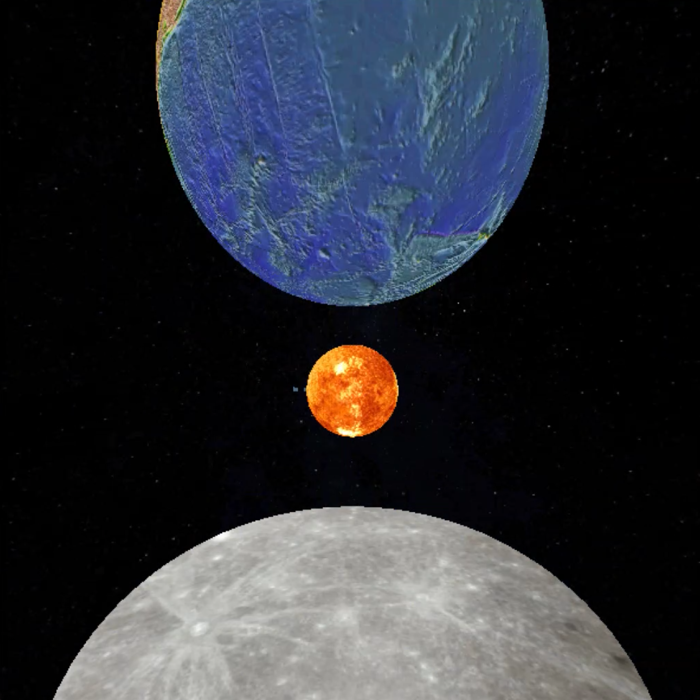
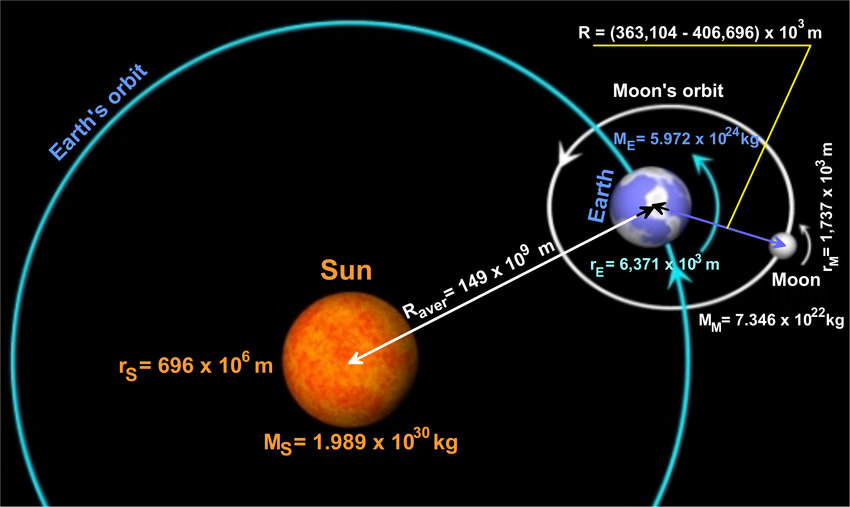
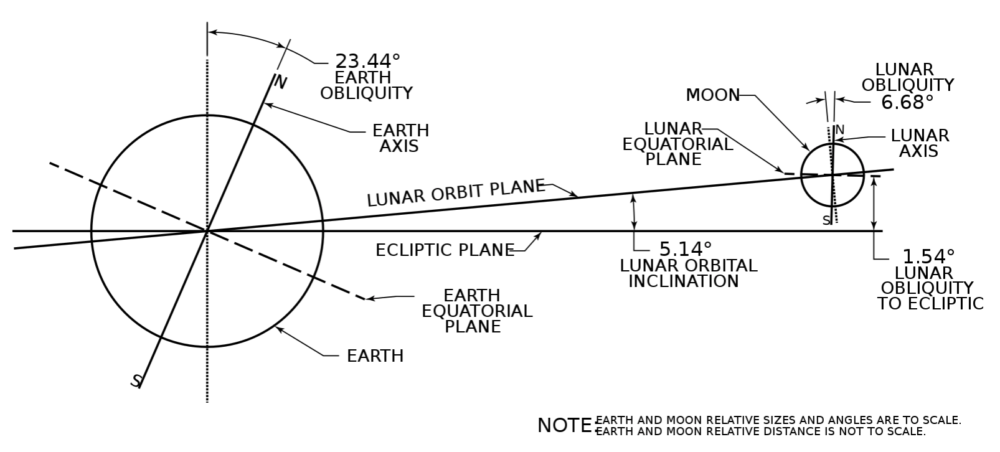
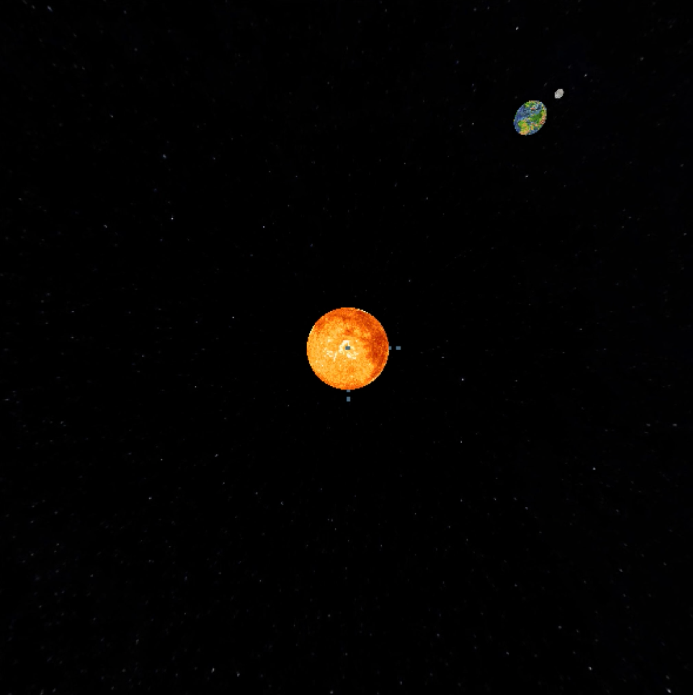
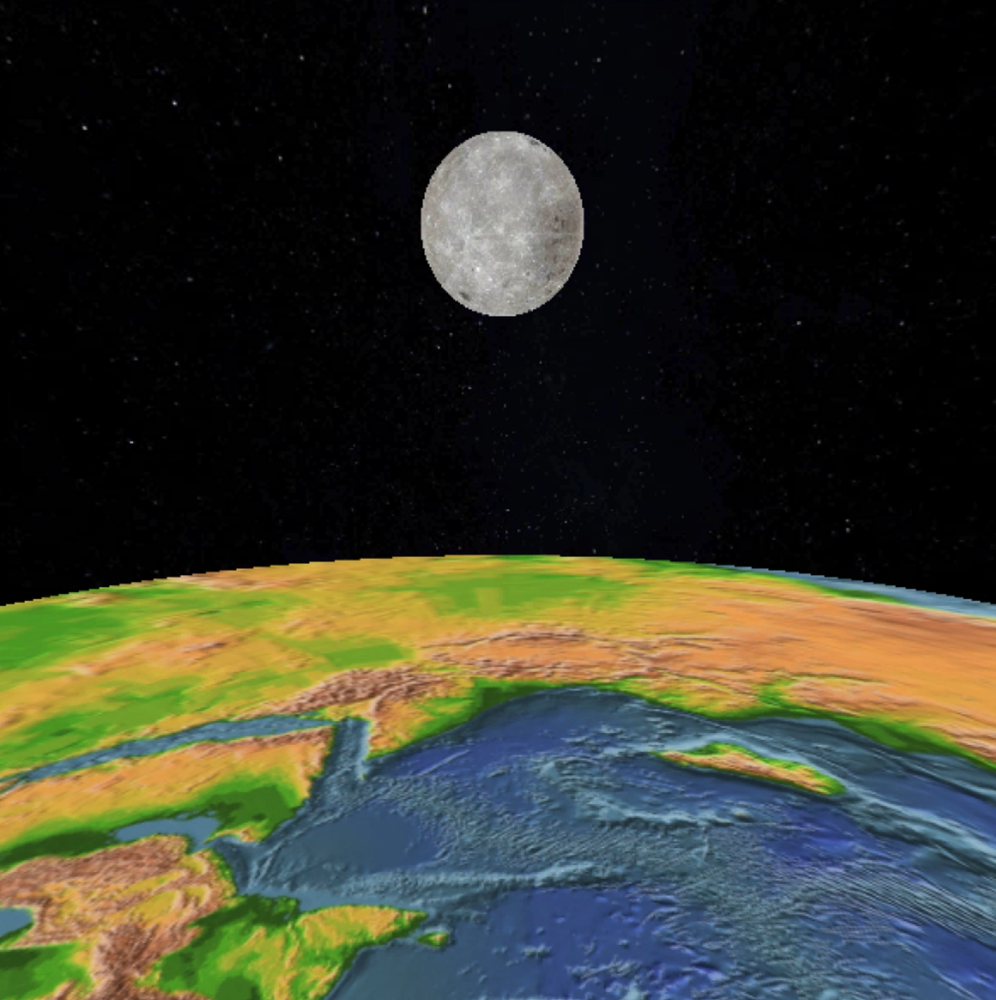
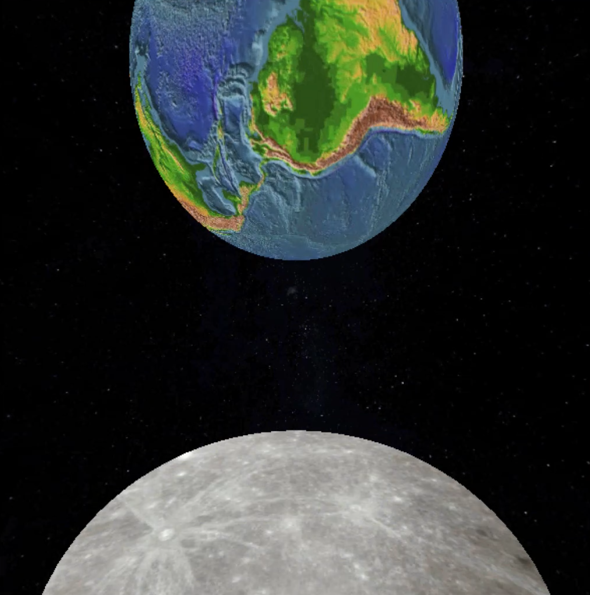
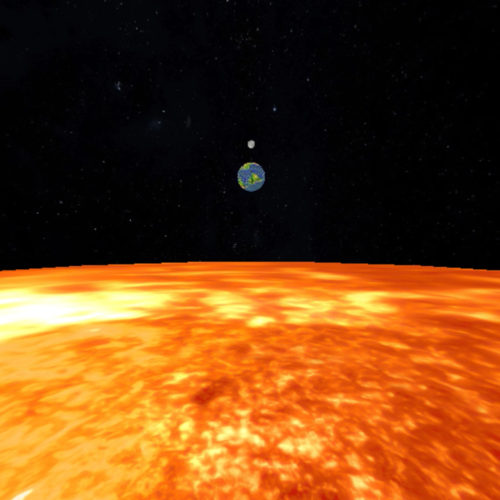

# Sun, Earth, Moon
A graphics simulation showing the relationship between the Sun, Earth, and Moon using an exaggeration of real-world data while maintaining key proportions. There are four views accessible with hotkeys and/or menu options, as outlined below. All bodies are textured, lit and follow Kepler’s Third Law of Planetary Motion. A user may also increase or decrease animation speed by pressing the up or down arrows.

<br>



#### Make
Compile project using Makefile. Default 'make' will build the project and object files. Add additional .cpp files at the top of the Makefile by appending with `SRC += [filename].cpp`.

```
make          # Builds executable
make run      # Builds executable and runs program
make clean    # Removes object files and project executable
make debug    # Adds Valgrind flags
make zip      # Zips project and all .cpp and .hpp files
```


#### Run
```
./sun-earth-moon
```

### Hotkeys
| Key  | Action               |
| ---- | -------------------- |
| v, V | Toggle through views |
| u    | Increase Speed       |
| U    | Decrease speed       |
| f, F | Freeze animation     |
| r, R | Reset scene          |
| s, S | Smooth Shading       |
| 0    | Toggle Light 0       |
| 1    | Toggle Light 1       |
| o, O | Orthographic camera  |
| p, P | Perspective Camera   |
| q, Q | Quit                 |

### Views

1. Overall view - where the viewer can see everything.
2. Earth View - Where the eye is somewhere on the Earth, looking somewhere interesting.
3. Moon View - Where the eye is somewhere on the Moon, looking somewhere interesting.
4. Sun View (optional) - Where the eye is somewhere on the Sun, looking somewhere interesting.

### Physics

   Kepler's Third law of planetary motion:
   Orbital Period is proportional to OrbitalRadius<sup>3/2</sup> = pow( OrbitalRadius, 3./2. )

## Data

<br>

**Sun** [(Wiki)](https://en.wikipedia.org/wiki/Sun):  
&emsp; **radius:** 696,342 km (432,687 miles)  
&emsp; **sidereal rotation period:** 25.05 days  
&emsp; **rotation velocity:** 7,189,000 km/h  (4,467,037.5 mph)  
&emsp; **orbital diameter:** 1.39 million km (864,000 miles)  
&emsp; **orbital circumference:** 4,379,000,000 km (2,720,984,450.8 miles)  


**Earth** [(Wiki)](https://en.wikipedia.org/wiki/Earth), 
**Orbit** [(Wiki)](https://en.wikipedia.org/wiki/Earth%27s_orbit):   
&emsp; **radius:** 6,371 km (3,958.8 miles)  
&emsp; **rotation period:** 1.0 days  
&emsp; **sidereal rotation period:** 0.99726968 days  
&emsp; **equatorial rotation velocity:** 0.4651 km/s (1,674.4 km/h, 1,040.4 mph)  
&emsp; **Inclination (relative to sun's equator):** 7.155º  
&emsp; **Inclination (relative to ecliptic plane):** 0.00005º  
&emsp; **Axial tilt (relative to ecliptic plane):** 23.44º  
&emsp; **axial rotation:** counter-clockwise  
&emsp; **orbital mean radius:** 149.60 million km (92.96 million miles)  
&emsp; **orbital circumference:** 940 million km (584 million miles)  
&emsp; **orbital period:** 365.256 days  
&emsp; **orbital speed:** 29.78 km/s (107,208 km/h; 66,616 mph)  
&emsp; **orbital rotation:** counter-clockwise  

**Moon** [(Wiki)](https://en.wikipedia.org/wiki/Moon), 
**Orbit** [(Wiki)](https://en.wikipedia.org/wiki/Orbit_of_the_Moon):  
&emsp; **radius:** 1,737.4 km (1,079.6 miles)  
&emsp; **rotation period:** 29.530 days (spin-orbit locked)  
&emsp; **sidereal rotation period:** 29.530 days (spin-orbit locked)  
&emsp; **equatorial rotation velocity:** 0.4627 km/s (1,665.7 km/h, 1,035.0 mph)  
&emsp; **Inclination (relative to ecliptic plane):** 5.14º  
&emsp; **Axial tilt (relative to lunar orbit plane):** 1.54º  
&emsp; **axial rotation:** counter-clockwise  
&emsp; **orbital mean radius:** 385,000 km (239,000 miles) from Earth's center  
&emsp; **orbital circumference:** 2,419,026 km (1,503,113 miles)  
&emsp; **orbital period:** 27.32 days (relative to stars)  
&emsp; **orbital speed:** 1.022 km/s (0.635 miles/s)  
&emsp; **orbital rotation:** counter-clockwise  



### Textures
Nasa Resources: [https://svs.gsfc.nasa.gov/](https://svs.gsfc.nasa.gov/)   
Nasa 3D Images: [https://nasa3d.arc.nasa.gov/images](https://nasa3d.arc.nasa.gov/images)  
CGI Moon Kit: [https://svs.gsfc.nasa.gov/4720](https://svs.gsfc.nasa.gov/4720)   
Solar System Textures: [https://www.solarsystemscope.com/textures/](https://www.solarsystemscope.com/textures/)


## Example Screenshots





